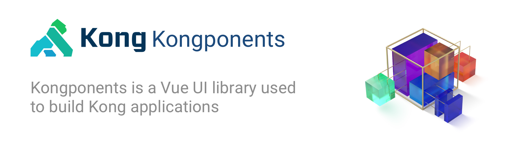

Kongponents is a Vue component library of frequently needed UI elements. They were developed to solve [Kong](https://konghq.com)'s application needs, but are generic enough to use in any web application.

## Installation

The version of Kongponents package(s) you install depends on the Vue dependency in your project.

### Choose your Vue dependency version

#### Vue 2.7

This version of all Kongponents removes the dependency of the external `@vue/composition-api` plugin and adds `vue` to the `peerDependencies`, requiring a version of `vue` that matches the following pattern: `>= 2.7.0 < 3`

All packages for Vue 2.7 utilize the `@latest` tag on npm, meaning you can install like this:

```shell
# Install the 7.x version
yarn add @kongponents/kbutton
```

#### Vue 2.6 and below

If you're installing for Vue `2.6.x` and below, you will want to install via the `@legacy` tag on npm like this:

```shell
# Install the 6.x version
yarn add @kongponents/kbutton@legacy
```

#### Vue 3

If you want to try out Vue 3 support, install the latest release of `@kong/kongponents` (note the new package name). [You can find more info on here for installation instructions and migration notes](https://kongponents.konghq.com/#installation).

### Component packages

To begin using Kongponents, you must first import the base `@kongponents/styles` package. [Read more about the style guide usage](./style-guide/usage.md).

Next, you will need to install each desired component. You can install multiple components at once, or one at a time as needed; however, keep in mind that you need to install the proper version based on your project's Vue dependency (as outlined above).

```shell
$ yarn add @kongponents/styles @kongponents/kbutton
```

### Transpile dependencies

You will likely need to transpile all of the `@kongponents` packages in your project. If your project already has a `vue.config.js` file, just add the following `transpileDependencies` entry

```js
// vue.config.js

module.exports = {
  transpileDependencies: [
    /@kongponents\/.*/
  ]
}
```

If your project does not have a `vue.config.js` file and instead uses webpack config files, you can add a loader rule (for example, for `babel-loader`) similar to the following (only showing the relevant entries)

```js
// webpack.config.js

module.exports = (env) => {
  return {
    module: {
      loaders: [
        // transpile @kongponents packages
        {
          test: /\.js$/,
          include: /(node_modules)\/(@kongponents)/,
          loader: 'babel-loader',
        },
        // process all .js files, but ignore all other node_modules not listed above
        {
          test: /\.js$/,
          exclude: /(node_modules)/,
          loader: 'babel-loader'
        },
      ]
    }
  }
}
```

### Raw loader

The `KIcon` component, utilized within many other components, imports .svg files directly, so a loader is needed in order to render these in your application such as the webpack [raw-loader](https://webpack.js.org/loaders/raw-loader/).

Start by installing `raw-loader`

```sh
yarn add --dev raw-loader
```

To utilize the loader, in your `vue.config.js` file, add the following inside `chainWebpack`

```js
module.exports = {
  chainWebpack: (config) => {
    // SVG Loader
    // With the following SVG rules, svg files may be imported from packages, Vue, etc. normally.
    // If referencing a SVG file from src/assets/img (local) you MUST add '.svg?local' suffix to the file path
    // for the webpack loader to properly render the file.

    const svgRule = config.module.rule('svg')

    svgRule.uses.clear()
    svgRule
      .oneOf('local')
      .resourceQuery(/local/)
      .use('url')
      .loader('url-loader')
      .options({
        limit: 10000,
        name: 'img/[name].[hash:7].[ext]'
      }).end().end()
      .oneOf('normal')
      .use('raw')
      .loader('raw-loader')
      .end().end()
  },
}
```

If you need to reference local SVG files (e.g. image assets for CSS background images) you will need to add the suffix `?local` to the end of the image filename. For example:

```html


<style>
  .image {
    background-image: url('../img/picture.svg?local');
  }
</style>
```

### CSS variables

If you choose to utilize any of the [CSS custom properties (variables)](https://developer.mozilla.org/en-US/docs/Web/CSS/Using_CSS_custom_properties) included in the `@kongponents` packages and your project uses [PostCSS](https://postcss.org/), you will likely need use the [`postcss-custom-properties` PostCSS plugin](https://github.com/postcss/postcss-custom-properties) so that the variables are preserved in their original form.

```sh
$ yarn add postcss-custom-properties --dev

# or

$ npm install postcss-custom-properties --save-dev
```

Next, add a `postcss.config.js` file to your project with the following content

```js
// postcss.config.js

module.exports = () => ({
  plugins: {
    'postcss-custom-properties': {
      preserve: true
    }
  }
})
```

## Usage

You can import and register components globally (e.g. in your Vue entry file, like `main.js`)

```js
import KButton from '@kongponents/kbutton';
Vue.component('KButton', KButton);
```

Or locally inside another component

```js
import KButton from '@kongponents/kbutton';
export default {
  ...
  components: { KButton },
  ...
};
```

## Without Bundle System

You can also use Kongponents in a project where there is no build system as long as Vue is included on the page. Each Kongponent [is packaged as a `umd.js` file](https://cli.vuejs.org/guide/build-targets.html#library), so as long as you have loaded Vue in your project the Kongponent will work as intended.

:::tip Note
You must import the CSS from the `@kongponents/styles` package along with Vue.
:::

<iframe width="100%" height="300" style="width: 100%;" scrolling="no" title="Vue 2 with Kongponents" src="https://codepen.io/adamdehaven/embed/RwLVQLw?default-tab=html%2Cresult" frameborder="no" loading="lazy" allowtransparency="true" allowfullscreen="true">
  See the Pen <a href="https://codepen.io/adamdehaven/pen/RwLVQLw">
  Vue 2 with Kongponents</a> by Adam DeHaven (<a href="https://codepen.io/adamdehaven">@adamdehaven</a>)
  on <a href="https://codepen.io">CodePen</a>.
</iframe>
